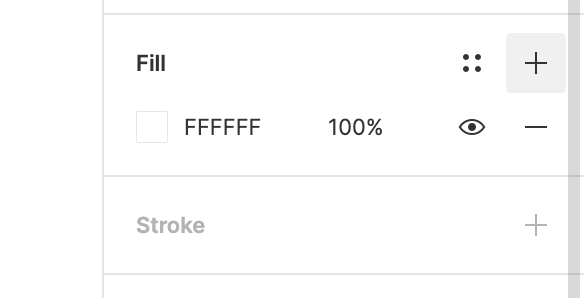
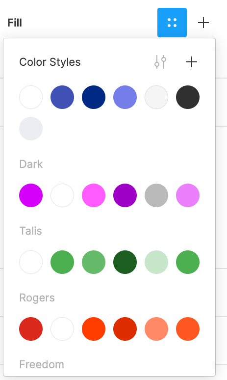
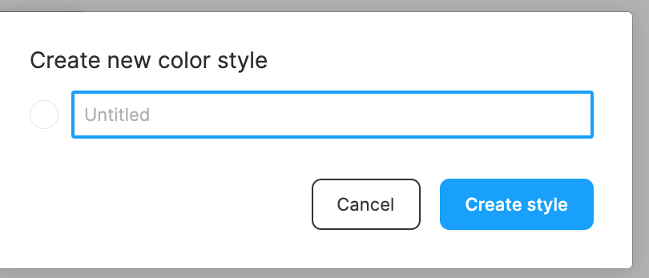

# Figma Theme Creator

## Quickstart
* Run `yarn` to install dependencies.
* Run `yarn build:watch` to start webpack in watch mode.
* Open `Figma` -> `Plugins` -> `Development` -> `New Plugin...` and choose `manifest.json` file from this repo.

⭐ To change the UI of your plugin (the react code), start editing [App.tsx](./src/app/components/App.tsx).  
⭐ To interact with the Figma API edit [controller.ts](./src/plugin/controller.ts).  
⭐ Read more on the [Figma API Overview](https://www.figma.com/plugin-docs/api/api-overview/).

## Toolings

This repo is using :
* React + Webpack
* TypeScript
* TSLint

# Automatic Create and Switch Themes  on different designs 🔥

  Select Your master component frame and change the colors of all components in just a single click ⭐🙈

  it will make your life easier 🤔

          🔥  ---------- Usage Details ------------🔥

#  ⭐ How to Create Local Style Variables ⭐

  Create a new file in figma and then create some local color variables in file using + sign to add new 
  color in the right side of figma toolbar and click to local styles menu and again click on + sign in color-styles menu.
  write your theme specific color name  😊

  Coloor variables : 

    1) Primary
    2) Secondary
    3) Danger
    4) Disabled

    5) Dark/Primary
    6) Dark/Secondary
    7) Dark/Danger
    8) Dark/Disabled

     #⭐ How to use plugin to create the theme  ⭐

  Select any frame or sigle button or Text and  Load Theme Switcher plugin on current selecton.it will show popup with plugun UI.
  Click on Create Theme with local variables button. it will get all of your local variabes and create a theme based on your variables name

  let's assume we have above variables in current project.
  you will get a list of two themes

             1) Default     2) Dark

  The plugin will generate theme names based on " / " in variable name.variable names without slash " / " pattern will consider as default theme otherwise first half before slash willl consider as theme name and second half will consider as color name.

     #⭐How to Switch on different Theme ⭐

  Select theme name from list and click on apply.it will change all the colors of frame or selected node that will be using the above theme variables.
  Delete your themes from plugin with Delete Button.